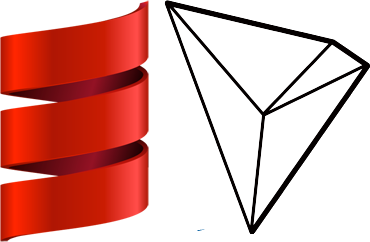

<h1 align="center">
  
  <br>
  scala-tron
  <br>
</h1>

<h4 align="center">
  Scala implementation of the <a href="http://wiki.tron.network">Tron Protocol</a>
</h4>

<p align="center">
  <a href="https://travis-ci.org/Rovak/scala-tron">
    
  </a>

  <a href="https://gitter.im/rovak/scala-tron">
    
  </a>

  <a href="https://github.com/rovak/scala-tron/issues">
    
  </a>

  <a href="https://github.com/rovak/scala-tron/pulls">
    
  </a>

  <a href="https://github.com/rovak/scala-tron/graphs/contributors">
    
  </a>
</p>

<p align="center">
  <a href="#quick-start">Quick Start</a> •
  <a href="#goals">Goals</a> •
  <a href="#how-to-use">How To Use</a> •
  <a href="#cluster">Cluster</a> •
  <a href="#wiki">Wiki</a> •
  <a href="CONTRIBUTING.md">Contributing</a> •
  <a href="#contact">Contact</a>
</p>


# What's TRON?

TRON is a block chain-based decentralized smart protocol and an application development platform. It allows each user to freely publish, store and own contents and data, and in the decentralized autonomous form, decides an incentive mechanism and enables application developers and content creators through digital asset distribution, circulation and transaction, thus forming a decentralized content entertainment ecosystem.

TRON is a product of Web 4.0 and the decentralized internet of next generation.

# Goals

* Compatible with [java-tron](https://github.com/tronprotocol/java-tron)
* Non-blocking
* Functional programming approach
* User-friendly interface

# Quick Start

This project requires SBT  
SBT (Simple Build Tool) is an open-source build tool for Scala and Java projects, similar to Java's Maven and Ant.  
Follow the instructions [installing SBT](http://www.scala-sbt.org/1.0/docs/Setup.html) to install SBT

```
git clone http://github.com/rovak/scala-tron
cd scala-tron
sbt "project cli" run
```

# How To Use

The application can be interfaced in 2 ways:
* Web Interface (API based)
* Command Line Interface (CLI)

## Command Line

To launch the project on a command line, First run:

`sbt "project cli" run`

After that the following commands are available:

### `address --open <private key>`

Opens a address

**Example**

```bash
> address --open BW4kf1Pyoi3XkKGF9FTMPFk8QBTezcb6QzD6EeYSXP73
Opened address 25ace46c656fb98027caee704a7790c7ec0b32fe
```

### `address --create`

Generates a new address

**Example**

```bash
> address --create
Address Generated!
Address: c93a9fe9a04524d7cb1f1413ac5e75f77b179e27
Private Key 67dsochCai4PdoLnzevHwXQWLeHiMKcEfoHEzLCDBu2X
```

### `account`

Show account key

### `balance`

Show account balance

### `send --to <address> --amount <amount>`

Sends the given amount to the given address

In order to execute the following commands, the cluster has to be up and running properly

### `cluster`

Start cluster as leader

### `cluster --join <address>`

Join cluster as client

### `server`

Starts the Web API server. After starting the API it can be reached at http://localhost:9000

### `grpc`

Starts the [GRPC](https://grpc.io/) server

## Cluster

Cluster is based on Akka.  
Akka is a toolkit for building highly concurrent, distributed, and resilient message-driven applications for Java and Scala  

To start a cluster follow the following steps:

* Start tron-cli `sbt "project cli" run`
* Run `cluster` which starts the node as leader
* The console will show the following logs  
```
[INFO] [01/18/2018 22:59:28.399] [main] [akka.remote.Remoting] Starting remoting
[INFO] [01/18/2018 22:59:28.553] [main] [akka.remote.Remoting] Remoting started; listening on addresses :[akka.tcp://TronCluster@127.0.0.1:41795]
```
* Copy the address (`127.0.0.1:41795`)
* Start a second instance which will join the cluster.
  The second client has to have a different database directory to prevent conflicts.
* Run `sbt -J-Ddatabase.directory=tron-data-client1 "project cli" run`.  
  `-J-Ddatabase.directory=tron-data-client1` specifies the database directory
* Run `cluster --join <address>` (example: `cluster --join 127.0.0.1:41795`)
* The client will now be joining the cluster

## Web API

Start the server using `sbt "project api" run`

The API will then be available on http://localhost:9000


### `GET /address/<address>`

Shows the balance of the address for the given public key

__Response__

```json
{
  "address": "a9c030dfbfb83f6c9454b5e1da5cecdb8737d4af",
  "balance": 10
}
```

### `POST /address`

Generates a new address

__Response__

```json
{
  "address": "fa7c845598653c11f01edda16d923b5ba7942e1e",
  "private_key": "GWCuQQCz7v9vXkn3BJMTmA86kj58UCdHmSw1tBu4DLe1"
}
```

## Wiki

* [Introduction (Tron Protocol)](http://wiki.tron.network)

## Contact

* [Gitter](https://gitter.im/Rovak/scala-tron)
* [Telegram](https://t.me/joinchat/CP8XKBIjEc0RqzJdl61OlQ)
